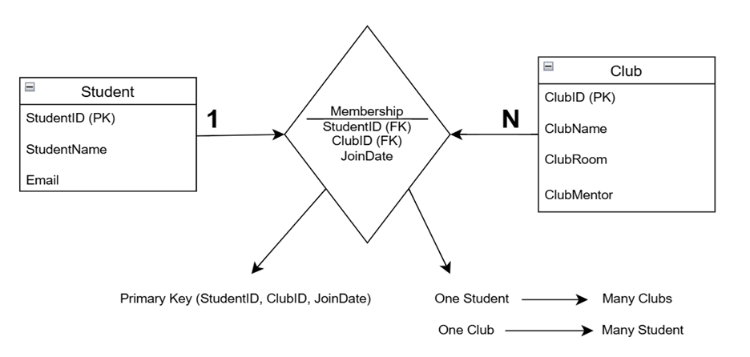
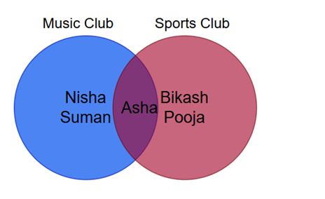
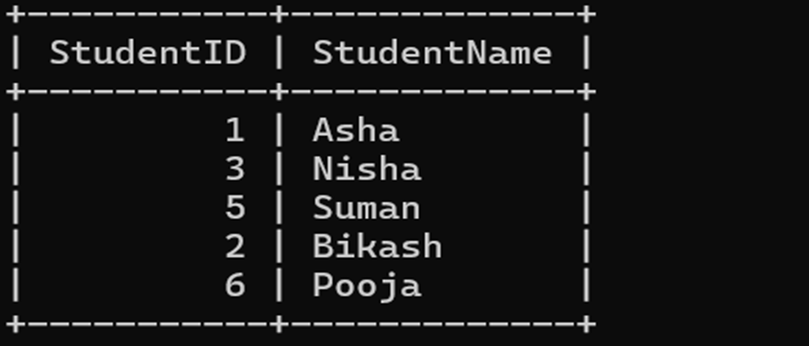
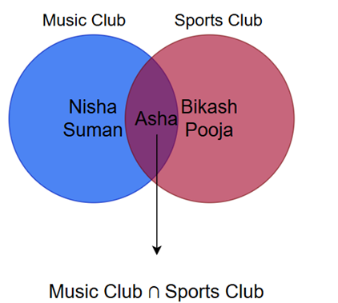
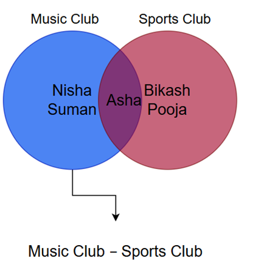
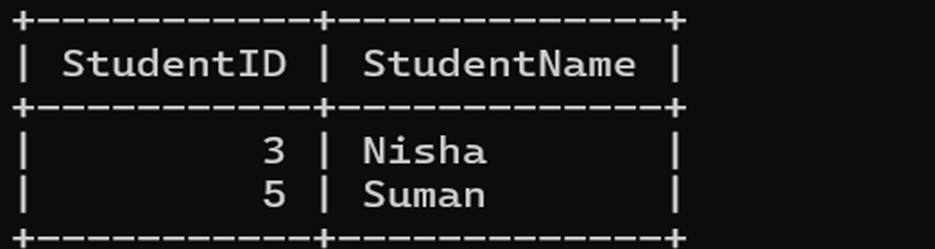

# Task 3 – Database Normalization & Optimization

A comprehensive demonstration of database normalization (1NF, 2NF, 3NF) and SQL operations using MySQL. This project simulates a **College Club Membership Management** system to eliminate redundancy and improve data integrity.

---

## Overview

This project demonstrates:

- **Database Normalization**: Progressive transformation from denormalized table through 1NF, 2NF, and 3NF
- **SQL Operations**: Basic operations (INSERT, SELECT), JOINs, and Set Operations (UNION, INTERSECT, EXCEPT)
- **Visual Representation**: ER Diagrams and Venn diagrams for set operations
- **Real-world Application**: College club membership management simulation

---

## Learning Objectives

- Identify data redundancy and anomalies in denormalized tables
- Apply First, Second, and Third Normal Forms
- Implement normalized schemas using SQL
- Understand JOIN operations to recombine normalized data
- Visualize set operations using Venn diagrams

---

## Repository Structure
```
task3/
├── README.md # Main documentation
├── Images/
│ ├── er-diagram.png # Entity Relationship Diagram
│ ├── union-query.png # UNION query screenshot
│ ├── union-venn.png # UNION Venn diagram
│ ├── union-result.png # UNION result screenshot
│ ├── intersect-query.png # INTERSECT query screenshot
│ ├── intersect-venn.png # INTERSECT Venn diagram
│ ├── intersect-result.png # INTERSECT result screenshot
│ ├── except-query.png # EXCEPT query screenshot
│ ├── except-venn.png # EXCEPT Venn diagram
│ └── except-result.png # EXCEPT result screenshot
│
├── Output/
│ ├── 1nf-table.txt # 1NF table output
│ ├── Student.txt # Student table output
│ ├── Club.txt # Club table output
│ ├── Membership.txt # Membership table output
│ ├── basic_sql_operation_output.txt # Basic SQL operations output
│ ├── join_operation_output.txt # JOIN operation output
│ └── Set_Operations_output.txt # Set operations output
│
└── sql/
├── create_tables.sql # Create database tables
├── normalization_steps.sql # Normalization process (1NF, 2NF, 3NF)
├── Basic_sql_operations.sql # Basic SQL queries
├── join_queries.sql # JOIN operation queries
└── set_operations.sql # UNION, INTERSECT, EXCEPT queries
```

---

## Quick Start

### 1. Clone the Repository
```bash
git clone https://github.com/shrishbc12/Foundation_assignment.git
cd task3
```
### 2. Start MySQL Container
```bash
docker run --name college_db \
  -e MYSQL_ROOT_PASSWORD=root123 \
  -e MYSQL_DATABASE=college_club \
  -d -p 3306:3306 \
  mysql:8.0
```
### 3. Execute SQL Scripts
```bash
# Create tables
docker exec -i college_db mysql -uroot -proot123 college_club < sql/create_tables.sql

# Run normalization steps
docker exec -i college_db mysql -uroot -proot123 college_club < sql/normalization_steps.sql

# Basic SQL operations
docker exec -i college_db mysql -uroot -proot123 college_club < sql/Basic_sql_operations.sql

# JOIN queries
docker exec -i college_db mysql -uroot -proot123 college_club < sql/join_queries.sql

# Set operations
docker exec -i college_db mysql -uroot -proot123 college_club < sql/set_operations.sql
```
### 4. Verify Results
```bash
# Check Student table
docker exec college_db mysql -uroot -proot123 -t college_club -e "SELECT * FROM Student;"

# Check Club table
docker exec college_db mysql -uroot -proot123 -t college_club -e "SELECT * FROM Club;"

# Check Membership table
docker exec college_db mysql -uroot -proot123 -t college_club -e "SELECT * FROM Membership;"
```
---

## Database Schema Evolution
### Unnormalized Form (Problem Table)
| StudentID | StudentName | Email           | ClubName     | ClubRoom | ClubMentor | JoinDate    |
|-----------|------------|----------------|-------------|---------|------------|------------|
| 1         | Asha       | asha@email.com | Music Club  | R101    | Mr. Raman  | 2024-01-10 |
| 2         | Bikash     | bikash@email.com | Sports Club | R202    | Ms. Sita   | 2024-01-12 |
| 1         | Asha       | asha@email.com | Sports Club | R202    | Ms. Sita   | 2024-01-15 |
| 3         | Nisha      | nisha@email.com | Music Club  | R101    | Mr. Raman  | 2024-01-20 |
| 4         | Rohan      | rohan@email.com | Drama Club  | R303    | Mr. Kiran  | 2024-01-18 |
| 5         | Suman      | suman@email.com | Music Club  | R101    | Mr. Raman  | 2024-01-22 |
| 2         | Bikash     | bikash@email.com | Drama Club  | R303    | Mr. Kiran  | 2024-01-25 |
| 6         | Pooja      | pooja@email.com | Sports Club | R202    | Ms. Sita   | 2024-01-27 |
| 3         | Nisha      | nisha@email.com | Coding Club | Lab1    | Mr. Anil   | 2024-01-28 |
| 7         | Aman       | aman@email.com | Coding Club | Lab1    | Mr. Anil   | 2024-01-30 |

### Problems Identified:
- Data Redundancy: Asha's name appears twice
- Update Anomaly: Changing mentor requires multiple updates
- Insertion Anomaly: Can't add club without student
- Deletion Anomaly: Removing last member deletes club info

### First Normal Form (1NF)
**Requirement:** All attributes must be atomic (indivisible)

Output file: [`output/1nf-table.txt`](Output/1nf-table.txt)

### Second Normal Form (2NF)
**Requirement:** Must be in 1NF + No partial dependencies

**Solution:** Split into 3 tables

Output files:
- [`output/Student.txt`](Output/Student.txt)
- [`output/Club.txt`](Output/Club.txt)
- [`output/Membership.txt`](Output/Membership.txt)

### Third Normal Form (3NF)
**Requirement:** Must be in 2NF + No transitive dependencies

**Solution:** Add ClubID as primary key

### Key Notes
| Normal Form|	Requirement|	How We Achieved|
|------------|-------------|-----------------|
|1NF|	Atomic values|	Each cell has single value|
|2NF| No partial dependencies|	Split Student and Club tables|
|3NF|	No transitive dependencies|	Added ClubID primary key|

---

## Entity Relationship Diagram



**Relationships:**
- **Student** ────< **Membership** >──── **Club**
- One student can join many clubs
- One club can have many students
- Membership table links them with JoinDate

---

## SQL Operations

### Basic SQL Operations
Output file: [`Output/basic_sql_operation_output.txt`](Output/basic_sql_operation_output.txt)

Includes:
- INSERT (adding new clubs and students)
- SELECT (viewing all records)

### JOIN Operation

Output file: [`Output/join_operation_output.txt`](Output/join_operation_output.txt)

```sql
SELECT s.StudentName, c.ClubName, m.JoinDate
FROM Membership m
JOIN Student s ON m.StudentID = s.StudentID
JOIN Club c ON m.ClubID = c.ClubID
ORDER BY s.StudentName, m.JoinDate;
```
### Why JOIN Operations Are Necessary
After normalization, data is split across tables:
- Student table - Student details only
- Club table - Club details only
- Membership table - Who joined which club

---

## Set Operations with Venn Diagrams
### 1. UNION - Students in Either Club
#### SQL Query
```sql
SELECT s.StudentID, s.StudentName
FROM Student s
JOIN Membership m ON s.StudentID = m.StudentID
JOIN Club c ON m.ClubID = c.ClubID
WHERE c.ClubName = 'Music Club'
UNION 
SELECT s.StudentID, s.StudentName
FROM Student s
JOIN Membership m ON s.StudentID = m.StudentID
JOIN Club c ON m.ClubID = c.ClubID
WHERE c.ClubName = 'Sports Club';
```

#### Venn Diagram


#### Result


### 2. INTERSECT - Students in Both Clubs
#### SQL Query
```sql
SELECT s.StudentID, s.StudentName
FROM Student s
JOIN Membership m ON s.StudentID = m.StudentID
JOIN Club c ON m.ClubID = c.ClubID
WHERE c.ClubName = 'Music Club'
INTERSECT
SELECT s.StudentID, s.StudentName
FROM Student s
JOIN Membership m ON s.StudentID = m.StudentID
JOIN Club c ON m.ClubID = c.ClubID
WHERE c.ClubName = 'Sports Club';
```

#### Venn Diagram


#### Result


### 3. EXCEPT - Students in One Club Only
#### SQL Query
```sql
SELECT s.StudentID, s.StudentName
FROM Student s
JOIN Membership m ON s.StudentID = m.StudentID
JOIN Club c ON m.ClubID = c.ClubID
WHERE c.ClubName = 'Music Club'
EXCEPT
SELECT s.StudentID, s.StudentName
FROM Student s
JOIN Membership m ON s.StudentID = m.StudentID
JOIN Club c ON m.ClubID = c.ClubID
WHERE c.ClubName = 'Sports Club';
```

#### Venn Diagram


#### Result


## Set Operations Summary
|Operation| Symbol| Description|	Example Result|
|---------|-------|------------|----------------|
|UNION	  |∪	|All students in either club|	Asha, Bikash, Nisha, Suman, Pooja|
|INTERSECT|	∩	|Students in both clubs|	Asha|
|EXCEPT	|-	|Students in first but not second	|Asha, Bikash, Nisha, Suman|

---

## License

This project is licensed under the MIT License - see the [LICENSE](LICENSE) file for details.

--

## References
- Alexander, S. (2024). What is a database? TechTarget.
- Gillis, A. S. (2024). Database normalization concepts.
- Codd, E. F. (1970). A Relational Model of Data for Large Shared Data Banks.


